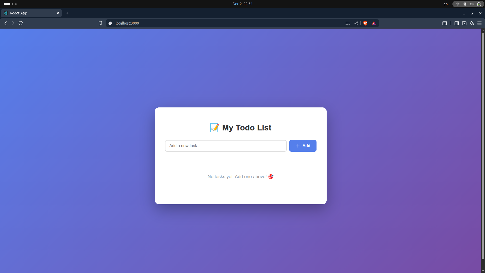
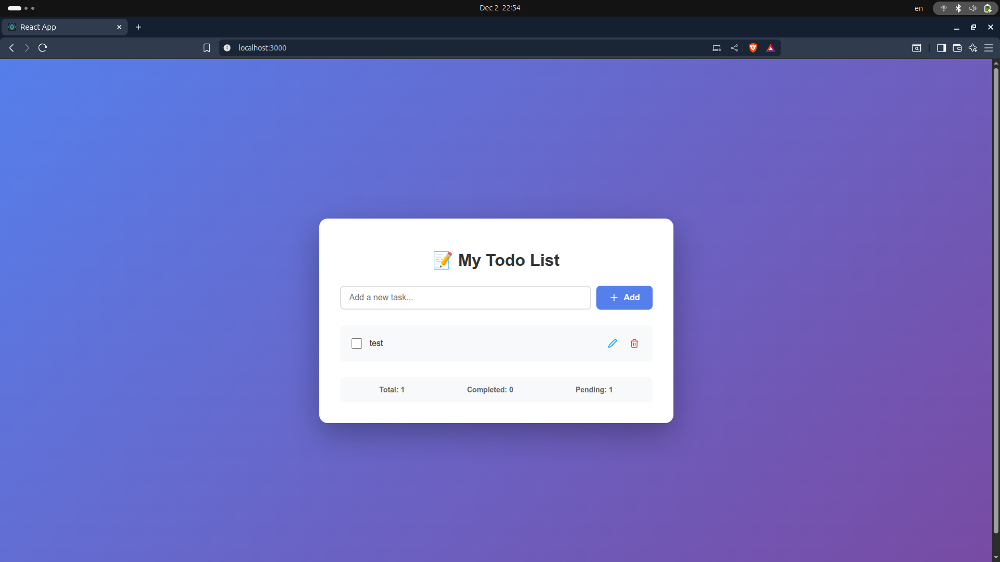

Todo List React App
A simple todo list application built with React, TypeScript, and Vite.

Features
Add tasks
Edit tasks
Delete tasks
Saves tasks in your browser (localStorage)
Screenshots
Home

## 📸 Screenshots

### Home Page 

 ### task added 

Run
Clone or download this repository.
Install dependencies: npm install
Start the development server: npm run dev
Open your browser to the URL shown in the terminal (usually http://localhost:5173).